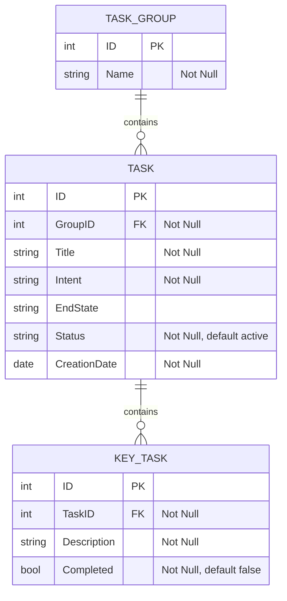

# Design

## Overview

The application organizes work into **Groups**, **Tasks**, and **Key Tasks**. The following diagram shows the structure of the data:

> [!NOTE]
> `ID` and `CreationDate` are generated automatically. All other fields marked "Not Null" must be provided by the user, unless they have a default.

### Groups

A group is a collection of related tasks. To create a group, only `Name` is required.

### Tasks

A task represents a specific objective to be accomplished. It belongs to one group and may contain multiple key tasks.

* **Intent** - What the task must achieve.
* **End State** - What success looks like when the task is done. Optional.

To create a task, the user must specify `Title` and `Intent`. Key tasks are added after the task is created.

`Status` can be changed freely after creation and is one of:

* `active` (default)
* `paused`
* `canceled`
* `completed`

### Key Tasks

A key task describes a specific action required to accomplish its parent task. To create a key task, only `Description` is required. `Completed` can be changed freely.

### Rules

* Deleting a group also deletes its tasks and their key tasks.
* Key tasks are shown in the order they were created.
